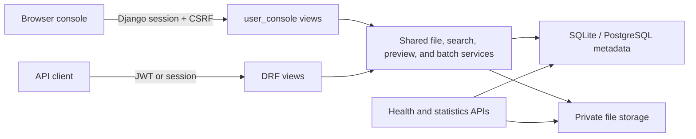

# Enterprise File Manager Console

A production-ready, security-focused multi-user file management application built with Django and Django REST Framework. It provides a responsive browser console and a JWT-enabled REST API over the same owner-scoped storage and query services.

The completed implementation includes authentication, private uploads, search and filtering, safe previews, batch operations, password reset, administrative statistics, health checks, structured logging, PostgreSQL support, Gunicorn, and a non-root Docker image.

## Status

- Django 5.2 and Django REST Framework 3.16
- 222 automated tests
- 99% application-code coverage
- SQLite development configuration
- PostgreSQL production configuration through `DATABASE_URL`
- Warning-clean production `check --deploy` profile
- Provider-neutral deployment and Docker configuration

## Features

### Accounts and authentication

- Custom user model with regular-user, application-administrator, and superuser roles
- Browser registration, session login, CSRF-protected logout, profile, and password change
- Signed, expiring, single-use password-reset links
- Account-discovery-safe reset responses
- JWT access and refresh tokens with refresh rotation and blacklisting
- Configurable throttling for registration, login, password reset, and token endpoints

### Private file management

- Authenticated upload, listing, detail, metadata update, download, preview, and delete
- UUID-based physical filenames and sanitized client filenames
- Owner-scoped access across REST, HTML, AJAX, preview, download, and batch operations
- Foreign and missing file identifiers consistently return `404`
- Streamed downloads with safe `Content-Disposition`, `nosniff`, and private no-store caching
- Physical-file cleanup coordinated with database lifecycle operations
- No unrestricted `/media/` route or public private-storage mapping

### Upload validation

- 50 MB per-file application limit
- Empty-file and unsupported-extension rejection
- Server-side MIME inspection with `python-magic` where available
- Executable/script MIME rejection and strict MIME checks for reliable formats
- Path traversal, NUL-byte, unsafe-character, and overlong-filename handling
- Supported extensions: JPG, JPEG, PNG, GIF, BMP, PDF, DOC, DOCX, TXT, RTF, XLS, XLSX, CSV, ZIP, RAR, and 7Z

### Search, previews, and batch operations

- Owner-scoped filename and description search
- File type, MIME type, date, and size filters
- Validated sorting and bounded server-side pagination
- Debounced live search using safe DOM APIs
- Safe inline previews for JPEG, PNG, GIF, and PDF
- Escaped, one-megabyte-bounded previews for TXT and CSV
- Batch delete and streamed ZIP download for up to 100 files
- 500 MB aggregate batch-download limit with sanitized, deduplicated ZIP entry names

### Operations and administration

- User dashboard with file count, storage usage, and recent files
- Public API discovery and dependency-aware health check
- Administrator-only aggregate user, file, and storage statistics
- Read-only file metadata in Django admin to prevent storage-lifecycle bypasses
- Structured authentication, file-operation, security, performance, error, and admin logs
- JSON production logging with reset-token, bearer-token, and common credential redaction
- Custom safe `404` and `500` pages

## Architecture



Application boundaries:

- `accounts` owns users, browser authentication, password reset, and JWT endpoints.
- `files` owns file metadata, validation, storage services, search, previews, batches, and REST endpoints.
- `user_console` owns the authenticated server-rendered console and AJAX enhancements.
- `core` owns discovery, health, statistics, security middleware, throttling, logging, and error handlers.
- `django_filemanagement` contains project-level settings, URLs, ASGI, and WSGI configuration.

## Technology stack

- Python 3.12+
- Django 5.2
- Django REST Framework 3.16
- Simple JWT 5.5
- Pillow and `python-magic`
- SQLite for local development
- PostgreSQL with Psycopg 3 for production
- Bootstrap 5 and vanilla JavaScript
- Gunicorn
- Pytest, pytest-django, pytest-cov, Coverage.py, and Black

## Quick start

### 1. Install system prerequisites

Python 3.12 or newer is required. `python-magic` also needs the platform `libmagic` library.

```bash
# macOS with Homebrew
brew install libmagic

# Debian/Ubuntu
sudo apt-get install libmagic1
```

The Docker image installs `libmagic1` automatically.

### 2. Create the environment

```bash
cd Django_FileManager
python3 -m venv .venv
source .venv/bin/activate
python -m pip install --upgrade pip
python -m pip install --requirement requirements.txt
```

`requirements.txt` includes development and test tools. Production environments and the Docker image use the smaller `requirements-prod.txt` set.

### 3. Initialize the application

```bash
python manage.py migrate
python manage.py createsuperuser
python manage.py runserver
```

Open [http://127.0.0.1:8000/](http://127.0.0.1:8000/).

Development defaults use SQLite, store private uploads under `uploads/`, and print password-reset email to the terminal. The fallback secret is development-only and production startup rejects it.

## Configuration

Settings read process environment variables directly. `.env.example` is a reference file; Django does not automatically load a local `.env` file. Supply variables through your shell, process manager, container runtime, or secret manager.

Common settings:

| Variable | Development default | Purpose |
| --- | --- | --- |
| `DEBUG` | `True` | Enables Django development behavior |
| `SECRET_KEY` | Development-only fallback | Required at 50+ characters in production |
| `ALLOWED_HOSTS` | Localhost and test hosts | Required explicitly in production |
| `DATABASE_URL` | Empty, using SQLite | PostgreSQL or SQLite database URL |
| `STATIC_ROOT` | `staticfiles/` | Destination for `collectstatic` |
| `MEDIA_ROOT` | `uploads/` | Private uploaded-file storage |
| `EMAIL_BACKEND` | Console backend | Password-reset email backend |
| `CACHE_BACKEND` | Local memory cache | Rate-limit cache backend |
| `SECURE_SSL_REDIRECT` | Off in development | Redirects HTTP to HTTPS |
| `SESSION_COOKIE_SECURE` | Off in development | Restricts session cookies to HTTPS |
| `CSRF_COOKIE_SECURE` | Off in development | Restricts CSRF cookies to HTTPS |
| `SECURE_HSTS_SECONDS` | `0` in development | Enables HTTP Strict Transport Security |
| `LOG_FORMAT` | `standard` | `standard` or one-line `json` logging |

The complete environment reference is in [`.env.example`](.env.example). Production startup fails closed without a long secret and explicit allowed hosts. `STATIC_ROOT` and `MEDIA_ROOT` are also rejected if they overlap.

## Browser console

The browser interface uses Django sessions and CSRF protection.

| Method | Route | Purpose |
| --- | --- | --- |
| `GET/POST` | `/accounts/register/` | Create an account |
| `GET/POST` | `/accounts/login/` | Sign in |
| `POST` | `/accounts/logout/` | Sign out |
| `GET` | `/accounts/profile/` | View account profile |
| `GET/POST` | `/accounts/password/change/` | Change an authenticated password |
| `GET/POST` | `/accounts/password/reset/request/` | Request a reset email |
| `GET` | `/accounts/password/reset/requested/` | Display the account-safe request result |
| `GET/POST` | `/accounts/password/reset/confirm/{uid}/{token}/` | Set a new password |
| `GET` | `/accounts/password/reset/complete/` | Display reset completion |
| `GET` | `/console/` | Dashboard and personal statistics |
| `GET` | `/console/profile/` | Console profile page |
| `GET` | `/console/files/` | Paginated personal file list |
| `GET/POST` | `/console/files/upload/` | Upload a file |
| `GET` | `/console/files/advanced/` | Search, filter, and sort files |
| `GET` | `/console/files/search/` | Search-page alias |
| `GET` | `/console/files/{id}/` | View file metadata |
| `GET` | `/console/files/{id}/preview/` | Preview supported content |
| `GET` | `/console/files/{id}/preview/content/` | Stream authorized inline preview content |
| `GET` | `/console/files/{id}/download/` | Download private content |
| `POST` | `/console/files/{id}/delete/` | Delete file content and metadata |
| `POST` | `/console/files/batch/` | Batch delete or ZIP download |
| `GET` | `/console/ajax/file-stats/` | Owner-scoped statistics JSON |
| `GET` | `/console/ajax/recent-files/` | Bounded recent-files JSON |
| `GET` | `/console/ajax/search/` | Bounded live-search JSON |
| `GET` | `/console/support/help/` | Authenticated help page |
| `GET` | `/console/support/contact/` | Authenticated support page |
| `GET` | `/console/support/terms/` | Authenticated terms page |
| `GET` | `/admin/` | Django administration for staff users |

## Django admin console

The Django administration site is available at [http://127.0.0.1:8000/admin/](http://127.0.0.1:8000/admin/) during local development.

Create an administrative login after applying migrations:

```bash
source .venv/bin/activate
python manage.py createsuperuser
```

Enter the requested username, email address, and password, then start the application:

```bash
python manage.py runserver
```

Open `/admin/` and sign in with the superuser credentials you created. To reset an existing admin password from the command line, run:

```bash
python manage.py changepassword YOUR_ADMIN_USERNAME
```

Administrative roles are intentionally distinct:

- A Django superuser created by `createsuperuser` receives `is_staff=True` and `is_superuser=True` and can access `/admin/`.
- An account with the application's `is_admin=True` flag can access aggregate application statistics, but that flag alone does not grant access to Django admin.
- Regular users cannot access either administrative interface.

File metadata is visible but read-only in Django admin. Adding, editing, or deleting file records there is disabled so administrators cannot bypass upload validation, ownership rules, or physical-file cleanup. Manage file content through the authenticated console or REST API instead.

## REST API

### Discovery, health, and statistics

| Method | Route | Access |
| --- | --- | --- |
| `GET` | `/api/` | Public API discovery |
| `GET` | `/api/health/` | Public database and storage health |
| `GET` | `/api/statistics/` | Application administrator or superuser |

The health endpoint returns `200` when the database and private storage are available and `503` otherwise. Failure responses expose generic dependency states, never credentials or internal paths.

### JWT authentication

| Method | Route | Purpose |
| --- | --- | --- |
| `POST` | `/api/auth/token/` | Obtain access and refresh tokens |
| `POST` | `/api/auth/token/refresh/` | Rotate a refresh token |
| `POST` | `/api/auth/token/blacklist/` | Revoke a refresh token |
| `GET` | `/api/auth/status/` | Verify current authentication |

Obtain a token pair:

```bash
curl --request POST http://127.0.0.1:8000/api/auth/token/ \
  --header 'Content-Type: application/json' \
  --data '{"username":"alice","password":"your-password"}'
```

Use the access token on protected API requests:

```bash
curl http://127.0.0.1:8000/api/files/my-files/ \
  --header 'Authorization: Bearer YOUR_ACCESS_TOKEN'
```

### File endpoints

| Method | Route | Purpose |
| --- | --- | --- |
| `GET` | `/api/files/` | List the authenticated user's files |
| `POST` | `/api/files/upload/` | Upload multipart `file` and optional `description` |
| `GET` | `/api/files/my-files/` | Search and paginate personal files |
| `GET` | `/api/files/{id}/` | Retrieve personal file metadata |
| `PUT` | `/api/files/{id}/` | Update `description` only |
| `DELETE` | `/api/files/{id}/` | Delete content and metadata |
| `GET` | `/api/files/{id}/download/` | Stream a private download |

Upload example:

```bash
curl --request POST http://127.0.0.1:8000/api/files/upload/ \
  --header 'Authorization: Bearer YOUR_ACCESS_TOKEN' \
  --form 'file=@./report.pdf' \
  --form 'description=Quarterly report'
```

Search example:

```bash
curl 'http://127.0.0.1:8000/api/files/my-files/?search=report&file_type=pdf&sort=-upload_date&page=1&page_size=20' \
  --header 'Authorization: Bearer YOUR_ACCESS_TOKEN'
```

Supported query parameters:

| Parameter | Description |
| --- | --- |
| `search` | Case-insensitive filename and description search, maximum 200 characters |
| `file_type` | Allowed extension, with or without a leading dot |
| `mime_type` | Exact case-insensitive MIME type |
| `date_from`, `date_to` | Inclusive ISO dates in `YYYY-MM-DD` format |
| `min_size`, `max_size` | Inclusive byte bounds |
| `sort` | `name`, `upload_date`, `file_size`, or `file_type`; prefix with `-` for descending |
| `page` | Positive page number |
| `page_size` | Positive size capped at 100; defaults to 20 |

API metadata never includes the private storage path or owner-controlled ownership fields. Only `description` is client-modifiable after upload.

## Security model

- Every file lookup begins with authenticated owner scope; administrators do not bypass personal-file ownership through normal endpoints.
- Browser mutations require CSRF-protected POST requests.
- Uploaded MIME headers are ignored in favor of server-side content inspection.
- Templates auto-escape metadata, live search uses `textContent`, and responses receive a restrictive Content Security Policy.
- Passwords use Django hashing and validation. Reset tokens expire, become invalid after use, and are not written to application logs.
- JWT refresh tokens rotate and previous tokens are blacklisted.
- Sensitive endpoints use configurable fixed-window or DRF throttling.
- Private downloads are streamed through authorization-aware views and are never served through a public media route.
- Production logs redact reset URLs, bearer credentials, passwords, secrets, and common API-key fields.
- Production defaults enable HTTPS redirects, secure cookies, HSTS, manifest static files, database connection health checks, and JSON logs.

See [SECURITY_REVIEW.md](SECURITY_REVIEW.md) for the adversarial review and [DEPLOYMENT.md](DEPLOYMENT.md) for proxy, HSTS, storage, and production controls.

## Testing and quality checks

Run the complete suite:

```bash
python -m pytest
```

Run coverage and formatting checks:

```bash
python -m coverage erase
python -m coverage run -m pytest
python -m coverage report --fail-under=90
python -m black --check accounts core django_filemanagement files user_console tests gunicorn.conf.py
```

Validate Django and migration state:

```bash
python manage.py check
python manage.py makemigrations --check --dry-run
```

Production deployment checks require the production environment described in [DEPLOYMENT.md](DEPLOYMENT.md):

```bash
python manage.py check --deploy
```

Tests use isolated databases and temporary media roots and do not depend on production filesystems or credentials.

## Docker

The image runs as an unprivileged `app` user and installs runtime dependencies only.

```bash
docker build --tag enterprise-file-manager:1.0 .
docker run --rm \
  --env-file .env \
  --publish 8000:8000 \
  --mount type=volume,source=filemanager-uploads,target=/app/uploads \
  enterprise-file-manager:1.0
```

Run database migrations and `collectstatic` as controlled release tasks rather than once in every web replica. The full provider-neutral checklist is in [DEPLOYMENT.md](DEPLOYMENT.md).

## Production process

Install runtime dependencies and run the release commands:

```bash
python -m pip install --requirement requirements-prod.txt
python manage.py check --deploy
python manage.py migrate --noinput
python manage.py collectstatic --noinput
gunicorn --config gunicorn.conf.py
```

Production requires PostgreSQL, durable private media storage, SMTP for password resets, a shared cache when enforcing limits across multiple replicas, and a TLS-terminating reverse proxy or load balancer. It does not assume Kubernetes or any cloud provider.

## Project structure

```text
.
├── accounts/                 User model, browser auth, reset workflow, JWT API
├── core/                     Health, discovery, statistics, errors, security, logs
├── django_filemanagement/    Project settings, URLs, ASGI, and WSGI
├── files/                    Models, validation, storage, search, preview, REST API
├── user_console/             Session-authenticated HTML console and AJAX views
├── templates/                Auth, console, support, component, and error templates
├── static/                   Source JavaScript, CSS, and image assets
├── tests/                    Full application and security regression suite
├── Dockerfile                Non-root production image
├── gunicorn.conf.py          Environment-driven Gunicorn configuration
├── requirements-prod.txt     Production runtime dependencies
├── requirements.txt          Development and CI dependencies
├── DEPLOYMENT.md             Production procedure and checklist
└── SECURITY_REVIEW.md        Security findings and controls
```

## Contributing

Before opening a change:

1. Keep all file access owner-scoped.
2. Add migrations for model changes and verify there is no unintended migration drift.
3. Add positive and important negative-path tests.
4. Run the full test, coverage, formatting, and Django checks above.
5. Never commit `.env`, SQLite databases, uploaded files, credentials, tokens, or generated static output.

Security issues should be disclosed privately to the repository owner rather than posted with exploit details in a public issue.

## Specification

The implementation was built incrementally from [Enterprise File Manager Console.md](Enterprise%20File%20Manager%20Console.md). The application now includes all phases through production readiness.
